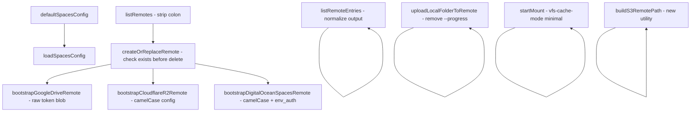

I have created the following plan after thorough exploration and analysis of the codebase. Follow the below plan verbatim. Trust the files and references. Do not re-verify what's written in the plan. Explore only when absolutely necessary. First implement all the proposed file changes and then I'll review all the changes together at the end.

## Observations

`file:backend/rcloneService.js` already exists with the full skeleton in place. However, comparing it line-by-line against the Python source (`features/rclone/__init__.py`, `features/cloudflare_r2/__init__.py`, `features/google_drive/__init__.py`) reveals **seven concrete bugs** that would cause runtime failures, plus a few missing helpers.

## Approach

Fix each divergence in `file:backend/rcloneService.js` in isolation, in dependency order (lowest-level helpers first, then callers). No new files are needed; all changes are confined to this one module.

---

## Implementation Steps

### 1 — Fix `listRemotes()`: strip trailing colons

`rclone listremotes` emits lines like `gdrive:`, `r2:`. The Python version strips the trailing `:` before returning. The JS version currently returns the raw lines, so callers receive `"gdrive:"` instead of `"gdrive"`, breaking every subsequent `remoteName` lookup.

In `listRemotes()`, after splitting on newlines, add `.map(line => line.endsWith(':') ? line.slice(0, -1) : line)` before the `.filter()`.

---

### 2 — Fix `createOrReplaceRemote()`: remove the `validTypes` allowlist and fix option skipping

**Two issues in one function:**

- The hardcoded `validTypes` array rejects valid rclone backends (e.g., any future provider). Python accepts any non-empty string. Remove the allowlist entirely; keep only the "name is required" and "type is required" guards.
- `_flatten_options()` in Python skips keys whose value is an **empty string** (not just `null`/`undefined`). The JS loop currently only skips `undefined`/`null`. Change the guard to also skip `value === ''` (after converting to string).
- Add a guard that throws `RCloneError` if `name` contains `:` (Python validates this).
- Change the unconditional `config delete` to only run when the remote already exists: call `listRemotes()` first and only delete if `name` is in the returned array.

---

### 3 — Fix `listRemoteEntries()`: normalize raw rclone JSON

Python's `list_remote_entries()` maps each raw rclone `lsjson` row into a clean shape:

```
{ name, path, size, modTime, isDir, isBucket }
```

The JS version returns the raw array. Update `listRemoteEntries()` to map the raw array through the same normalization: read `row.Name`, `row.Path`, `row.Size`, `row.ModTime`, `row.IsDir`, `row.IsBucket` and emit the camelCase shape. Use `Math.max(0, Number(row.Size) || 0)` for `size`.

Also fix the `_remote_spec` logic: Python validates that `remoteName` does not contain `:` before appending it. Add that guard.

---

### 4 — Fix `bootstrapCloudflareR2Remote()`: align with actual config file format

The real `.appdata/cloudflare-r2/config.json` uses **camelCase** keys (`accessKeyId`, `secretAccessKey`, `endpoint`, `bucketName`, `keyPrefix`) — confirmed by `load_r2_config()` in `features/cloudflare_r2/__init__.py`. The JS version reads snake_case keys (`account_id`, `access_key_id`, `secret_access_key`) and constructs the endpoint from `account_id`, which is wrong.

Rewrite the destructuring in `bootstrapCloudflareR2Remote()` to read `accessKeyId`, `secretAccessKey`, `endpoint` directly from the parsed config. Validate that all three are non-empty strings. Pass `env_auth: 'false'` as an explicit option to `createOrReplaceRemote()`. Use the fixed remote name `'r2'` (not the bucket name).

---

### 5 — Fix `bootstrapDigitalOceanSpacesRemote()`: align with Python's camelCase schema

Python's `bootstrap_digitalocean_spaces_remote()` expects camelCase keys (`accessKeyId`, `secretAccessKey`, `endpoint`, `region`, `locationConstraint`) and reads `endpoint` directly from the config rather than constructing it from `region`. It also passes `env_auth: 'false'` and conditionally adds `location_constraint`.

Update `bootstrapDigitalOceanSpacesRemote(config)` to:
- Destructure `accessKeyId`, `secretAccessKey`, `endpoint`, `region`, `locationConstraint` (all camelCase).
- Validate `accessKeyId`, `secretAccessKey`, and `endpoint` are non-empty.
- Pass `env_auth: 'false'` in the options object.
- Conditionally add `location_constraint: locationConstraint` only when `locationConstraint` is non-empty.
- Remove the `endpoint` construction from `region`.

---

### 6 — Fix `bootstrapGoogleDriveRemote()`: pass raw token blob

Python passes the entire `token.json` content as a compact JSON string directly to rclone (`json.dumps(parsed, separators=(",", ":"))`) — rclone expects its own token format. The JS version reformats the token into a hand-crafted object, which may drop fields rclone needs.

Update `bootstrapGoogleDriveRemote()` to pass `JSON.stringify(token)` (the full parsed token object) as the `token` option value, instead of the hand-crafted subset. Keep the `refresh_token` presence check as the validation guard.

---

### 7 — Fix `loadSpacesConfig()`: return defaults instead of null

Python's `load_spaces_config()` returns `default_spaces_config()` when the file is missing or invalid. The JS version returns `null`, which forces every caller to null-check.

Add a `defaultSpacesConfig()` helper that returns the same shape as Python:
```
{ accessKeyId, secretAccessKey, endpoint, bucketName, keyPrefix, region, locationConstraint }
```
all defaulting to `''`. Update `loadSpacesConfig()` to return `defaultSpacesConfig()` instead of `null` when the file is absent or unparseable.

---

### 8 — Fix `startMount()`: use `--vfs-cache-mode minimal`

Python uses `minimal`; the JS version uses `full`. Change the `--vfs-cache-mode` argument to `'minimal'` to match. Also remove the `--no-modtime` and `--no-checksum` flags that have no Python equivalent.

---

### 9 — Fix `uploadLocalFolderToRemote()`: remove `--progress` flag

The `--progress` flag writes ANSI escape sequences to stdout, which is harmless interactively but pollutes the server log and can confuse `spawnSync` output parsing. Python does not pass `--progress`. Remove it from the `runRcloneCommand` args array.

---

### 10 — Add `buildS3RemotePath()` utility

Python exports `build_s3_remote_path(bucket_name, key_prefix)` which constructs `"<bucket>/<prefix>"` or `"<bucket>"`. Add the equivalent `buildS3RemotePath(bucketName, keyPrefix = '')` to `rcloneService.js` and include it in the `runRcloneOperation` dispatcher under a `'build_s3_path'` case. This is used by the UI layer when constructing `remotePath` for S3-backed remotes.

---

### Dependency diagram

